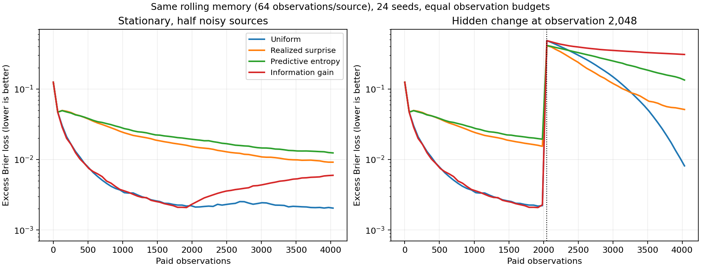

# Attachment P1: acquisition, computation, and representation falsifiers

The broad agent goal remains active. P1 directly tests a restricted version of H4,
source mechanisms relevant to H8/H4, and a representational premise of H2.
It does not train the attachment’s goal generator or consolidation controller.
Read HYPOTHESES-LEDGER.md for all fourteen hypotheses and unmeasured work.

## Frozen acquisition experiment

Protocol and scorer were committed at `b0a4718` before scored execution.
Twenty-four seeds × three environments × two estimators × four policies give
576 trajectories and 2,359,296 paid observations. Each trajectory has 4,096
observations across 32 sources, including two warmup observations per source.
Ten percent uniform exploration is shared by the three adaptive controllers.
Only selected outcomes reach the learner. Private source probabilities are
used to evaluate predictions, never to choose actions or update the posterior.

The main loss is excess expected Brier loss: the mean squared error of the
predicted probability. It removes the irreducible observation-noise floor.
Lower is better. Values below average all sources, steps and 24 seeds.

| Environment | Retained observations per source | Uniform | Surprise | Entropy | Information gain |
|---|---:|---:|---:|---:|---:|
| deterministic | all | 0.004261 | 0.004035 | 0.004035 | 0.004035 |
| deterministic | 64 | 0.004317 | 0.004091 | 0.004091 | 0.004092 |
| mixed | all | 0.005220 | 0.019220 | 0.020910 | 0.005168 |
| mixed | 64 | 0.005583 | 0.020211 | 0.023221 | 0.006727 |
| mixed_change | all | 0.129487 | 0.092999 | 0.146441 | 0.112227 |
| mixed_change | 64 | 0.089545 | 0.090994 | 0.140951 | 0.185179 |

In stationary mixed data, lifetime-count surprise allocates 94.25% of observations
to the irreducibly fair sources (uniform: 49.85%). Its main loss is 3.68× uniform,
and higher on every seed. Entropy similarly pursues noise. In the deterministic
condition, all three adaptive controls improve over uniform: this is a failure
of interpreting surprise under noise, not a claim that surprise never helps.

Surprise also beats lifetime-count uniform after hidden change. It accumulated
less old evidence for deterministic sources, so faster recovery is partly an
acquisition/history interaction; this experiment does not isolate a better
change detector. In the rolling-memory change condition, surprise has lower
second-half error than uniform but slightly worse whole-stream error and much
worse endpoint error. Preserve those distinct outcomes.

Information gain is not a universal replacement. With rolling memory and
hidden change its main loss is 2.07× uniform and endpoint loss is 0.306504
versus 0.006300. Finite memory repeatedly discards evidence, making repeated
noise observations appear informative to its stationary posterior. The 10%
exploration floor does not repair this within the tested lifetime.

The analytic counterexample is even simpler: Beta(1,1) and Beta(512,512)
both predict a fair bit and have entropy ln(2), but their expected information
gains are 0.193147 and 0.000488 nats. Predictive uncertainty alone cannot tell
which source is poorly known. Independent numerical integration agrees with
the information-gain formula to 3.1e-11 on four other Beta fixtures.

## Costs and verification

Scoring took 14.142s including data generation and reporting.
Per-cell timers include policy, update, evaluation and trajectory hashing;
they are not isolated inference latency or equal-wall-time comparisons.
All policies have equal observation budgets, but adaptive policies scan 32
scores per post-warmup choice. The implementation stores some shared arrays
even where a specialized uniform implementation would not need them. Reported
array bytes include all 24 learners plus shared harmonic values and exclude
Python overhead, evaluator random tapes, output JSON and allocator overhead.

Audit took 24.085s: all 576 action/outcome hashes replay exactly,
all 2,359,296 selected posterior counts are reconstructed from raw outcome
histories, 1,179,648 full-snapshot source posteriors agree, and saved metrics
have zero discrepancy. Replay reuses the policy code; it is not an independent
implementation of the entire experiment. The separate histories, numerical
integration, input hashing and allowed-action checks test different failure modes.

Individual seeds and learning traces are in the raw JSON. The compact result
also gives paired differences and descriptive 95% t intervals across seeds.
They are not corrected for multiple comparisons or a population generalization
beyond these constructed environments. No scorer settings were tuned after results.

## CTM: retrospective thinking time does not save executed work

Unchanged upstream forward and certainty functions were AST-extracted into
counted fixture modules. At configured budgets 1, 4 and 16, the first output
has certainty 1.0 and both parity analysis selectors choose index 0. The forward
still executes 1, 4 and 16 attention/synapse/neuron-model/output calls.
Prediction-plus-certainty output storage is 48, 192 and 768 bytes for the
three-example fixture. These counts establish this code path’s behavior, not
trained CTM speed, quality, or all CTM variants. A causal early-exit controller
could change the implementation; it must be implemented and measured.

The certainty function is one minus normalized predictive entropy. A fixture
with wrong logits [20,-20] and target 1 still reports certainty 1.0. This
rejects confidence-as-correctness as a guarantee, not empirical CTM calibration.

## Metis: useful native memory, bounded guarantees

The attachment does not uniquely identify “Metis.” This audit uses MemTensor’s
Memory Foundation Model repository as the likely match, not a confirmed
citation identity. Its default selects hidden states and applies a gated delta
write with a normalized matrix-memory read. Its training setup learns memory
parameters from later query responses while freezing the backbone. That is a
useful example of learning storage for future use, not inference-time slow
weight consolidation. The training data are not included in the repository.

The unchanged shared gated-update mixin and normalized local-memory read were
run with chosen alpha=.9, beta=.8 and update_ratio=.9. An old orthogonal read
falls from .5 to .033197 after 32 writes; independent matrix and normalizer
recurrences agree to 8.9e-16. These chosen gates are not measured trained gates.
Normalization does not fully cancel decay because the denominator adds 1.

Holding hidden vectors and weights fixed, reversing two writes within a batch
leaves the parallel approximation identical, whereas the corresponding
sequential recurrence differs by .04716. The code documents its approximation.
A contextual backbone can encode order into different hidden vectors; this is
not a claim that the whole model cannot represent temporal order.

The inference driver resets memory for each independent session. Its default
exchange commit includes both user text and generated answers. Generated text
can be useful episodic data, but it is not independent confirmation of itself.
The three task-loss interfaces currently share shifted cross entropy; operation
semantics may still be learned from examples. No full Metis checkpoint was run.

## Desire and success: an interface distinction, not a new objective class

For known outcome probabilities p(y|s,a), drive consequences d(y), and current
weights w, linearity gives E[w·d(y)] = w·E[d(y)]. Ten thousand random fixtures
with five actions, three outcomes and four drives select identical actions
under both calculations; maximum numerical score difference is 8.9e-16.
A cached scalar using old weights selects a different action in 4,509 fixtures.
That weaker interface omits the new preference input; it cannot establish
superiority over a scalar value conditioned on the same inputs.

Separate desirability, success and epistemic confidence may improve learning,
reweighting and diagnosis. That empirical claim remains open. Homeostatic
control can also be represented by rewards/costs on augmented state. Hard
constraints and unbounded/lexicographic preferences need separate treatment;
this finite expected-utility check does not collapse every objective to one
finite scalar penalty. A learned goal generator still needs an outer criterion.

## Architectural consequence

Predict the value of additional evidence separately from surprise. Evaluate
candidate changes on subsequent real outcomes, include resource and retention
costs, and test noise, drift and disappearing knowledge separately. Extra
thinking must actually stop or skip computation to earn an efficiency claim.
Use structured motivation as inspectable conditioning, not proof of autonomous
goal-space invention. HYPOTHESES-LEDGER.md defines the next learned controls.

## Pinned source locations

- CTM: `continuous-thought-machines` at `4a6c9c3a7fb5dc4bca6381cc7883a3b9252c6466`; `models/ctm.py`, `models/utils.py`, `tasks/parity/analysis/run.py`.
- Metis: `MemTensor/Metis` at `22f7aabc8d3e9c39fcea676b11a10007bc8b3748`; `metis/configuration_metis.py`, `metis/dev_beta/metis_hyper_memory.py`, `metis/dev_beta/metis_local_memory.py`, `run_inference.py`, `train/dataset.py`, `train/losses.py`, `scripts/train.sh`.
- Both full git clones are on the WD research drive. No rendered repository pages or large model weights were used.

